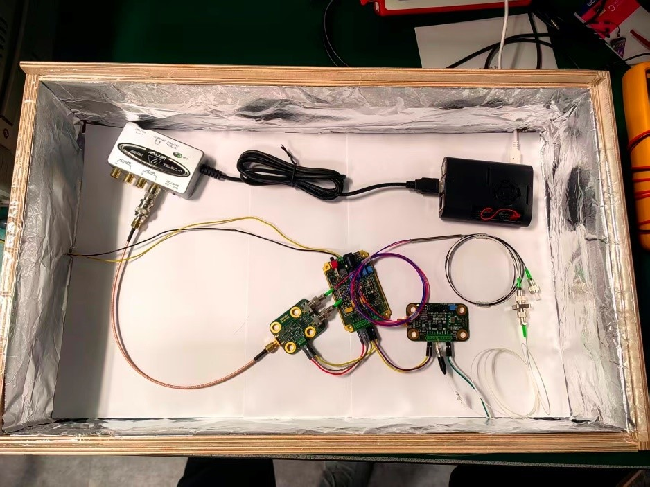
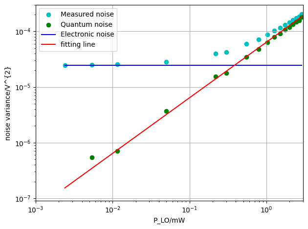
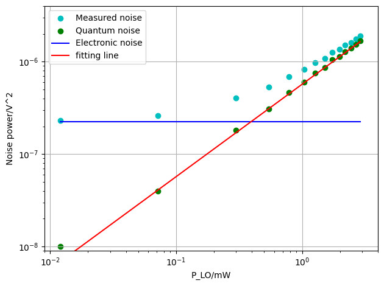
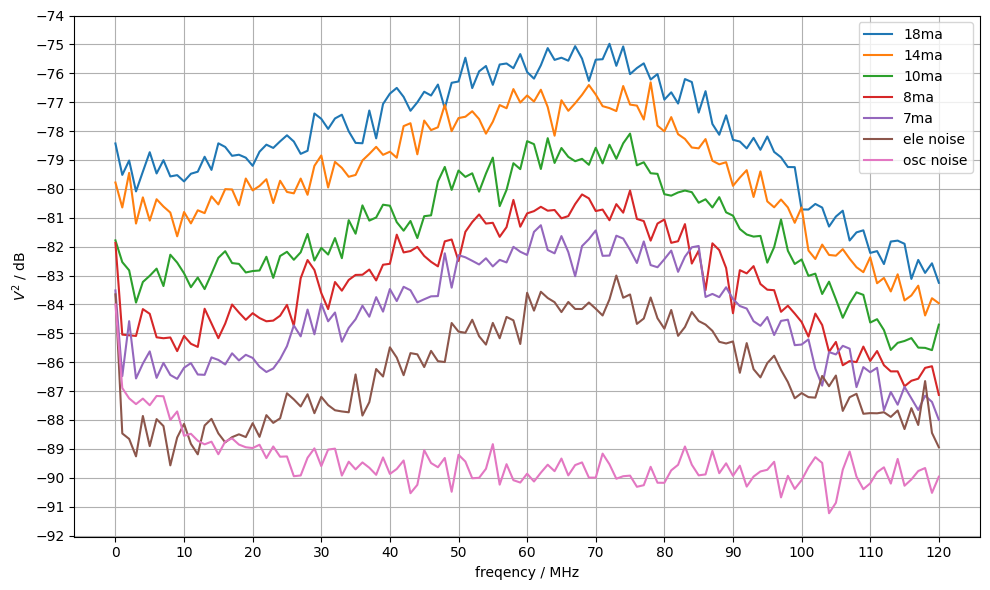
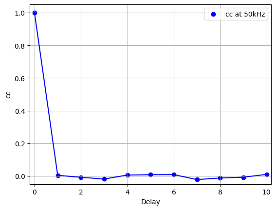

# Cost-effective-practical-quantum-random-number-generator-QRNG

This project aims to design and implement a cost-effective practical quantum random number generator (QRNG) based on vacuum fluctuation. 

The picture of the QRNG is shown as follow. The QRNG comprises  parts: laser diode for coherent light, balanced homodyne detector (BHD) and Raspberry Pi for post extraction, which are all off-the-shelf products.

The amplitude and phase quadratures of laser diode both fluctuate independently, which is also named as shot noise.

The BHD implement homodyne detection after 50/50 beamsplitter equally divide the incident laser. It amplifies the magnitude of signal beam (here refers to vacuum state) with smaller power via the much stronger local oscillator (LO) beam whilst noise of LO is suppressed. Here the phase difference of signal beam and LO beam is $\phi=0$ and the output voltage of BHD follows Gaussian distribution.

We want the QRNG to generate uniformly distributed bits, hence we sample with an audio interface and extract randomness from BHD with Toeplitz-hashing extractor on Raspberry Pi. In extraction program, a pseudo-random seed is used as an example. 

Some important characters like linearity, bandwidth and correlation coefficient of BHD are also measured, the measured results are shown as follows.

An experiment was implemented to generate 1 billion random bits and the random bits passed a standard NIST test. The test result is displayed in **finalAnalysisReport.txt**.
